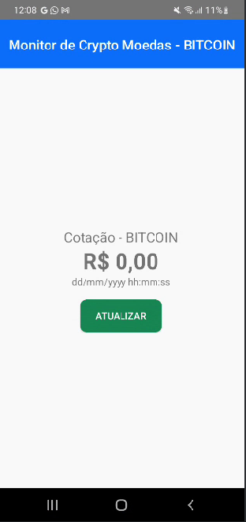
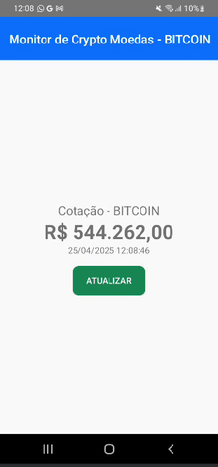

# Projeto: Android-crypto-monitor 

Um projeto Android que monitora o valor do Bitcoin através de uma Api, atualizando o valor ao clicar no botão "Atualizar".

## 📱 Telas

Após entrar no aplicativo, a tela será a seguinte:



Clicando no botão "Atualizar", essa será a tela:



## 🧱 Estrutura do projeto

```
 android_crypto_monitor/
    ├── app/
    │   ├── build.gradle.kts (App-specific build configuration)
    │   └── src/
    │       └── main/
    │           ├── java/
    │           │   └── toffolipereira/
    │           │       └── com/
    │           │           └── example/
    │           │               └── android_crypto_monitor/
    │           │                   ├── MainActivity.kt (Main activity)
    │           │                   ├── model/ (Data model classes)
    │           │                   │   ├── Ticker.kt
    │           │                   │   └── TickerResponse.kt
    │           │                   └── service/ (Networking service)
    │           │                       ├── MercadoBitcoinService.kt
    │           │                       └── MercadoBitcoinServiceFactory.kt
    │           └── res/ (Layout files, resources)
    │               └── layout/
    │                   └── activity_main.xml
    ├── build.gradle.kts (Root-level build configuration)
    └── gradle.properties (Project properties)
```

- **Model:** Responsável por definir as classes (`TickerResponse`), dados recebidos da API.
- **View:** Parte visual que o usuário vê (UI), representada pela (`MainActivity.kt`) e seu layout correspondente (`activity_main.xml`).
- **Tratamento de dados:** Usa Retrofit para fazer as requisições e Gson para converter JSON em objetos Kotlin.

## ⚙️ Tecnologias Adicionais

- **Gson:** Permite com que o Json seja interpretado pelo Android por meio do gson.
- **Coroutines:** Permite chamadas assíncronas sem travar a interface. 
- **Retrofit:** Simplifica as requisições com APIs HTTP.

## 🧩 Principais Classes e Componentes

### TickerResponse:

Contém os campos last (valor da cotação) e date (data da cotação).

```
class Ticker(
val last: String,
val date: Long,
(outros valores não utilizados)
)
```

### MercadoBitcoinService:

Interface que define a chamada GET para obter os dados da API.

```
interface MercadoBitcoinService {
@GET("api/BTC/ticker/") // Pega a informação
suspend fun getTicker(): Response<TickerResponse> // Faz a requisição
}
```

### MercadoBitcoinServiceFactory:

Cria e configura uma instância do Retrofit com base na URL da API e usa Gson para conversão de dados.

```
fun create(): MercadoBitcoinService {
    val retrofit = Retrofit.Builder() // Instancia o retrofit.
        .baseUrl("https://www.mercadobitcoin.net/") // Pegar a base da url onde será feito a requisição HTTP.
        .addConverterFactory(GsonConverterFactory.create()) // Converter o JSON para o GSON
        .build()

    return retrofit.create(MercadoBitcoinService::class.java) // Retornar a instancia do retrofit para a classe MercadoBitcoinService
}
```

## 🎨 Interface do Usuário (UI)

- **strings.xml** e **colors.xml**: Definem textos, cores e labels usados na UI.
- **Layouts reutilizáveis:**

  - **component_button_refresh.xml**: Botão “Atualizar” com estilo próprio.
  - **component_quote_information.xml**: Mostra a cotação, valor e data.
  - **component_toolbar_main.xml**: Cabeçalho (toolbar) do app.
  - **activity_main.xml**: Tela principal que junta os componentes acima.

## 🔧 MainActivity.kt

- Configura a UI e toolbar.
- Define ação do botão "Atualizar" para buscar os dados da API com makeRestCall().
- **Trata a resposta:**

    - **Sucesso**: mostra o valor formatado em reais e a data formatada.
    - **Falha**: exibe um "Toast" com mensagens de erro (400, 401, 403, 404 ou erro desconhecido).
  
## ✅ Resultado Final

O app mostra a cotação do Bitcoin em reais, com data atualizada e um botão para o usuário atualizar manualmente.